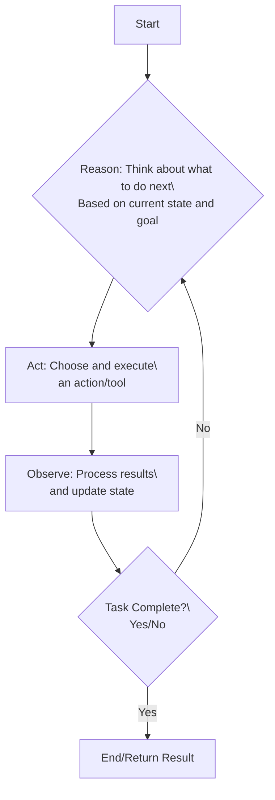

# ReAct Loop Visualization

## ReAct Loop Explanation
The ReAct (Reason → Act → Observe) loop is a fundamental pattern for AI agents that enables them to:
1. **Reason**: Determine what action to take based on current context and goals
2. **Act**: Execute the chosen action using available tools
3. **Observe**: Process the results and update internal state
4. **Repeat**: Continue until the task is complete

This pattern allows agents to dynamically adapt their behavior based on environmental feedback, making them more flexible and capable than purely scripted approaches.