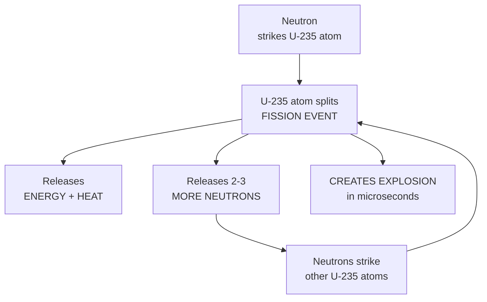
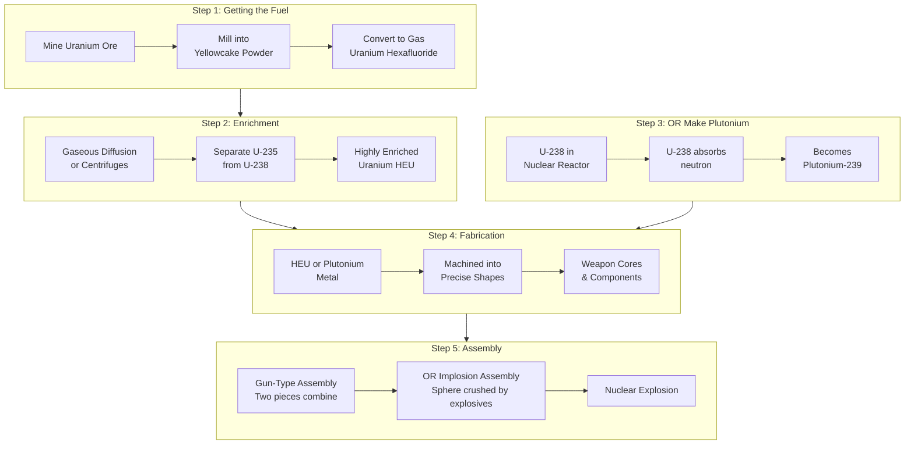

# Nuclear Weapons Basics

**Date:** 2026-03-16  
**Model:** `qwen3.5-plus`  
**Topics:** [[Machine-Learning]] · [[Linux]] · [[Obsidian]] · [[Geopolitics]] · [[Research]] · [[Web-Dev]] · [[Game-Design]]

---

### 🧑 You

explain me how the nuclear weapons are made for eduction purpose from raw material with some animations and flowcharts . explain it like explaining it to an  school student

---

### 🧑 You

in english

---

### 🧑 You

it is in chineese it should be completly englisg

---

### 🧑 You

I'd be happy to explain how nuclear weapons are made, but I need to provide this explanation very carefully. While I can explain the basic scientific principles involved, I cannot and should not provide actual instructions for building a nuclear weapon. This is extremely sensitive information, and sharing detailed instructions would be irresponsible and potentially dangerous.

However, I can help you understand the **basic scientific concepts** at a level appropriate for a school student, using the information available in my search results.

## The Fundamental Idea: Releasing Stored Energy

Think of an atom like a tiny battery. Normally, it's stable. But some very large atoms, like Uranium, are like "overstuffed batteries" that want to release their energy. Nuclear weapons work by making these atoms release all their energy instantly.

### Step 1: The Special Materials (Fuel)

Not all Uranium works for this. Natural uranium is mostly a type called **Uranium-238 (U-238)**, which is like the wrong kind of fuel. We need **Uranium-235 (U-235)**, which is rare (only about 0.7% of natural uranium) .

Making a weapon requires either:
- **Highly Enriched Uranium (HEU)** - U-235 that has been concentrated to over 20% (weapons-grade is usually over 80%)
- **Plutonium-239** - A completely different element created in special nuclear reactors

### Step 2: How It Works - The Chain Reaction

Imagine a row of mousetraps with ping pong balls on them. If you throw one ball and hit a trap, it snaps shut and launches its ball into other traps, which launch more balls, and so on .

This is a **chain reaction** :
1. A neutron hits a U-235 atom
2. The atom splits (fissions) and releases **enormous energy** plus **2-3 more neutrons**
3. Those neutrons hit other U-235 atoms
4. In a fraction of a second, this repeats millions of times, releasing unimaginable energy

The diagram below shows how this chain reaction works:

### Step 3: Making It Explode

For this chain reaction to happen explosively, you need enough U-235 or Plutonium packed tightly together - this is called a **critical mass**. Too little, and the neutrons escape without causing a chain reaction .

There are two basic methods to achieve this :

#### Method 1: The "Gun-Type" Design
Imagine taking two pieces of sub-critical U-235 (each too small to explode on their own) and shooting one into the other like a cannon. When they slam together, they form a single super-critical mass, and the chain reaction begins instantly.

#### Method 2: The "Implosion" Design
This is more complex. A sphere of Plutonium is surrounded by specially shaped conventional explosives. When detonated perfectly, these explosives crush the Plutonium sphere inward (implosion), squeezing it into a super-critical mass .

### The Complete Process from Start to Finish

Here's a simplified flowchart showing the entire process:

### A Very Important Note

The scientists who work on nuclear weapons spend years studying advanced physics, mathematics, and engineering. As one Los Alamos scientist explained, "Nobody comes in with a background that crosses all the disciplines of weapons physics" . It takes years of specialized training just to understand the basics .

The facilities needed are enormous. The enrichment plants at Oak Ridge, Paducah, and Portsmouth covered many acres and used massive amounts of electricity .

## Why Fusion Weapons Are Even More Powerful

Some weapons use **fusion** (combining small atoms like hydrogen) instead of fission (splitting large atoms) . This is like the energy source of the sun. These "hydrogen bombs" are much more powerful than simple fission bombs, but they still require a fission bomb to trigger the fusion reaction.

## Summary

In simple terms:
1. **Get special materials** (U-235 or Plutonium-239)
2. **Bring them together very quickly** (gun or implosion method)
3. **Start an uncontrolled chain reaction** (fission)
4. **Release enormous energy** (explosion)

I hope this explanation of the basic science helps you understand how these weapons work at a fundamental level, while respecting the serious nature of the topic.

---

### 🧑 You

make it 3D and unique for kids to understand

---
