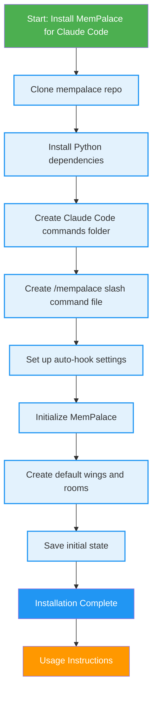

```mermaid
flowchart TD
    A[Start: Install MemPalace for Claude Code] --> B[Clone mempalace repo]
    B --> C[Install Python dependencies]
    C --> D[Create Claude Code commands folder]
    D --> E[Create /mempalace slash command file]
    E --> F[Set up auto-hook settings]
    F --> G[Initialize MemPalace]
    G --> H[Create default wings and rooms]
    H --> I[Save initial state]
    I --> J[Installation Complete]
    J --> K[Usage Instructions]
    
    style A fill:#4CAF50,color:white
    style J fill:#2196F3,color:white
    style K fill:#FF9800,color:white
    
    classDef step fill:#E3F2FD,stroke:#2196F3,stroke-width:2px;
    class B,C,D,E,F,G,H,I step;
```